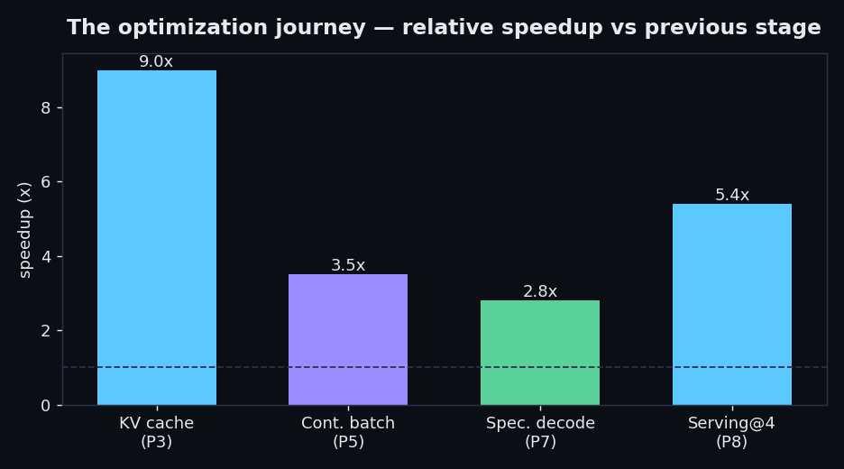
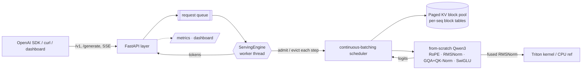
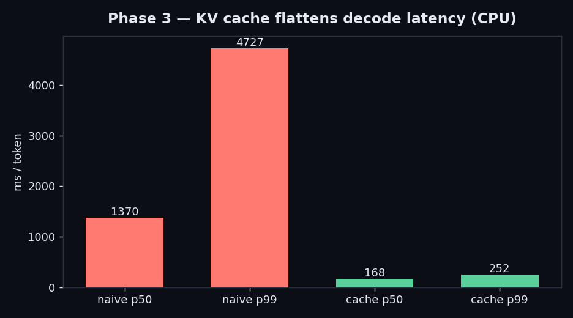
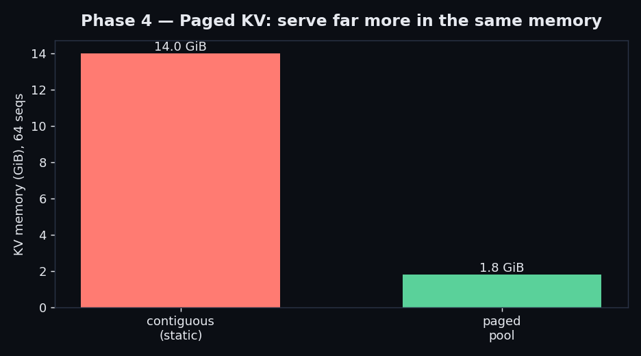
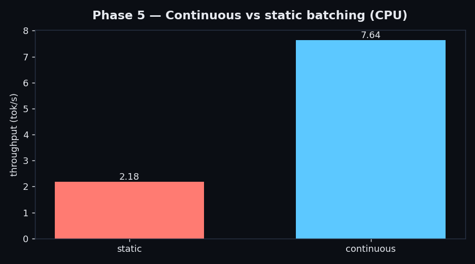
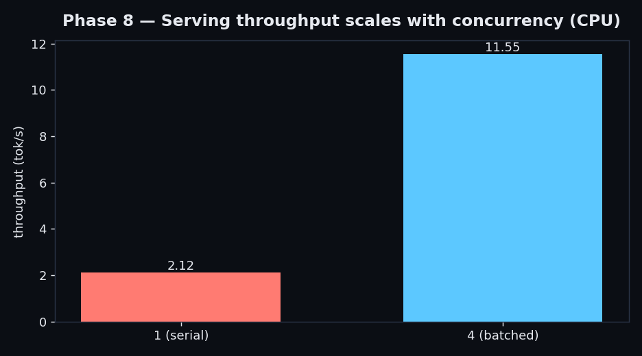

# mini-vLLM — a from-scratch LLM inference engine

[](https://github.com/vineetsista/minivllm/actions/workflows/ci.yml)
[](LICENSE)
[](pyproject.toml)
[](https://github.com/astral-sh/ruff)
[](https://mypy-lang.org/)

A high-performance LLM inference engine built **from scratch** in Python
(PyTorch + Triton) — the model, the KV cache, the paged-attention memory manager,
the continuous-batching scheduler, speculative decoding, a custom kernel, and an
**OpenAI-compatible serving layer**. The point is the *optimization journey*: load
a real open-weight model correctly, then climb the performance curve with a
measured before/after at every step.

> **Point the official `openai` SDK at it and it just works.** No account, no key —
> the same `/v1/chat/completions` your app already calls, served by a homemade
> Qwen3 engine with PagedAttention and continuous batching underneath.

```python
from openai import OpenAI
client = OpenAI(base_url="http://localhost:8000/v1", api_key="not-needed")
client.chat.completions.create(
    model="minivllm",
    messages=[{"role": "user", "content": "Explain KV caching in one line."}],
    stream=True,
)
```

Target model: **Qwen/Qwen3-0.6B** (Apache 2.0). Modern transformer stack: RoPE,
RMSNorm, grouped-query attention with QK-Norm, SwiGLU.



---

## Highlights

- **From-scratch correctness.** Logits match the HuggingFace reference
  token-for-token before any optimization, and every cache/scheduler/decoder
  variant is gated against single-sequence decode token-for-token.
- **The full inference stack.** KV cache → **paged** KV cache (PagedAttention) →
  **continuous batching** → speculative decoding → a fused **Triton** kernel →
  serving — each with a measured win.
- **Drop-in OpenAI API** with **SSE token streaming**, a **Prometheus `/metrics`**
  endpoint, and a **live web dashboard** (throughput, latency, KV-cache
  utilization, batch occupancy, plus a streaming playground).
- **Real systems coherence.** PagedAttention is wired into the live serving
  engine — one shared block pool, per-sequence block tables — not a side demo.
- **int8 weight quantization** (2.2× smaller) and bf16/fp16 paths.
- **Engineered like production:** CI (ruff + mypy + tests), an offline-fast test
  tier, typed throughout, MIT-licensed, `pip`-installable, Docker image.

## Quickstart

```bash
python -m venv .venv && . .venv/Scripts/activate   # Windows; use bin/activate elsewhere
pip install torch --index-url https://download.pytorch.org/whl/cpu
pip install -e ".[dev]"
```

Serve it (OpenAI-compatible, with the dashboard at `/`):

```bash
python -m uvicorn minivllm.server:app --port 8000     # add MINIVLLM_PAGED=1 for paged KV
# open http://localhost:8000/   ·   metrics at /metrics   ·   docs at /docs
pip install openai && python -m scripts.openai_client_demo
```

Or call the native API / stream tokens:

```bash
curl -s localhost:8000/generate -d '{"prompt":"The capital of France is","stream":true}'
```

Generate from the CLI, or reproduce any benchmark:

```bash
python -m scripts.generate --prompt "Once upon a time"
python -m scripts.bench_all          # regenerate every number below
python -m pytest                     # fast suite (no downloads); --runslow for HF gates
```

## Architecture



```
minivllm/
  config.py · model.py · layers.py · loader.py   # the model + weight loading
  cache.py                  # contiguous KV cache (Phase 3)
  paged_cache.py            # block allocator + paged KV cache (Phase 4)
  batched_cache.py          # batched-decode KV cache (Phase 5)
  paged_batched_cache.py    # paged pool behind batched serving (Wave 2)
  generate.py               # naive + cached single-sequence decode, sampling
  engine.py                 # continuous-batching scheduler (static vs continuous)
  speculative.py            # speculative decoding (draft + verify + rollback)
  server.py                 # streaming ServingEngine + FastAPI + dashboard + metrics
  openai_api.py             # /v1/chat/completions, /v1/completions, /v1/models
  quantization.py           # int8 weight-only quantization
  kernels.py                # fused RMSNorm Triton kernel (CUDA) + CPU reference
  dashboard.html            # live web dashboard
scripts/   # one CLI per benchmark + demos (bench_all, *_demo, loadtest, plot_results)
tests/     # fast tier (offline) + slow HF-reference gates (--runslow)
```

Design intent: clean separation between **model**, **KV-cache manager**,
**scheduler**, and **serving layer**, with Python overhead off the hot path. The
cache implementations share one `extend`/`advance` interface, so paging swaps in
behind the model untouched; RMSNorm delegates to a kernel seam so Triton swaps in
behind the layers untouched.

## The optimization journey

Every technique, measured on the same CPU dev box (Intel i7-1250U, float32,
Qwen3-0.6B) against the previous stage. Correctness is gated at every step.

| Phase | Technique | Headline result (CPU) |
|---|---|---|
| 1 | Correct forward pass | logit parity vs HF (max abs diff ~1.7e-5, argmax 100%) |
| 2 | Naive decode + baseline | ~1.0 tok/s; O(n²) latency growth (p99 4727 ms/tok) |
| 3 | KV cache | **~9×** decode throughput; latency flat (p99 4727 → 252 ms/tok) |
| 4 | Paged KV cache | **7.8×** less KV memory, **8×** more concurrent seqs (12.9% → 100% util) |
| 5 | Continuous batching | **~3.5×** throughput vs static (occupancy 1.5 → 3.5 of 4 slots) |
| 6 | Fused Triton kernel | RMSNorm kernel, CUDA-gated + CPU reference (validate free on a Colab T4) |
| 7 | Speculative decoding | **~2.8×** wall-clock, 4.3× fewer target forwards (93% acceptance) |
| 8 | Serving + load test | **~5.4×** throughput at concurrency 4 vs serialized |
| + | int8 quantization | model **2.24×** smaller (logit cosine 0.99943) |

<p align="center">
  
  <br/>
  
  
</p>

See [`docs/DESIGN.md`](docs/DESIGN.md) for the engineering decisions behind each
phase, and [`docs/ROADMAP.md`](docs/ROADMAP.md) for what's next.

## Testing & development

```bash
pytest                 # fast tier: offline, deterministic, ~5s
pytest --runslow       # + HF-reference correctness gates (downloads Qwen3-0.6B)
ruff check . && ruff format --check . && mypy minivllm
make test  /  make lint  /  make bench  /  make serve
```

The fast tier never hits the network: model-based fast tests use tiny
random-weight models, while the token-for-token gates against HuggingFace are
auto-detected and skipped unless `--runslow`. CI runs lint + types + the fast tier
on every push.

## Hardware — CPU by design

Every number above is measured on a **CPU-only** laptop, and that is the point:
the wins here are *algorithmic* — paging, batching, speculation, quantization —
and show up at any scale, at zero infrastructure cost. Nothing in the engine
depends on a GPU to run or to be correct.

The one GPU-specific piece, the fused Triton kernel, ships with a CPU-identical
PyTorch reference (so the engine behaves the same everywhere) and a `pytest` gate
that validates the kernel wherever CUDA exists. Want to see it light up for free?
Open [`notebooks/minivllm_colab.ipynb`](notebooks/minivllm_colab.ipynb) on a free
Colab **T4** — it runs the kernel gate and the GPU benchmarks
(`scripts/kernel_bench.py`, `scripts/benchmark.py --device cuda`) in a couple of
minutes, no rental required. To run the whole engine on a GPU, install the CUDA
torch wheel and `pip install -e ".[gpu]"`.

## License

MIT — see [LICENSE](LICENSE). Qwen3-0.6B is Apache 2.0.
